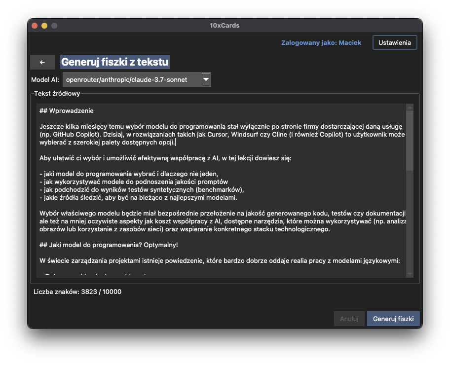

# Wprowadzenie ✨

Witamy w świecie 10xCards! Ta sekcja pomoże Ci zrozumieć, czym jest nasza aplikacja, dla kogo została stworzona i jakie problemy pomoże Ci rozwiązać.

## Co to jest 10xCards?

10xCards to aplikacja desktopowa (aktualnie w wersji MVP dla systemu macOS) zaprojektowana specjalnie dla profesjonalistów, którzy chcą efektywnie przyswajać nową wiedzę i umiejętności. Wykorzystujemy siłę fiszek edukacyjnych, aby proces nauki był szybszy i bardziej skuteczny.

Kluczowe cechy 10xCards:

*   **Automatyczne generowanie fiszek:** Dzięki integracji ze sztuczną inteligencją (różne modele LLM), możesz błyskawicznie tworzyć fiszki z dostarczonego przez Ciebie tekstu. Koniec z żmudnym przepisywaniem! 
*   **Manualne tworzenie fiszek:** Jeśli wolisz, zawsze masz możliwość samodzielnego dodawania i edytowania fiszek.
*   **Nauka oparta na nauce (FSRS):** Korzystamy z algorytmu powtórek rozłożonych w czasie FSRS, który optymalizuje Twój proces nauki, prezentując Ci materiał w najbardziej odpowiednich momentach.
*   **Wsparcie dla wielu użytkowników:** Aplikacja pozwala na tworzenie osobnych profili dla różnych użytkowników na jednym komputerze, z opcjonalną ochroną hasłem.
*   **Lokalne przechowywanie danych:** Wszystkie Twoje dane (profile, talie, fiszki, postępy w nauce) są bezpiecznie przechowywane lokalnie w bazie danych.

## Dla kogo jest ta aplikacja?

10xCards jest idealnym narzędziem dla:

*   **Profesjonalistów** zdobywających nowe umiejętności zawodowe.
*   **Studentów** przygotowujących się do egzaminów.
*   **Osób uczących się języków obcych.**
*   Każdego, kto chce **efektywnie zapamiętywać informacje** i ceni swój czas.

## Główne korzyści i problem, który rozwiązuje

Czy zdarzyło Ci się spędzać godziny na manualnym tworzeniu fiszek? Wiemy, jak bardzo może to być czasochłonne i zniechęcające. 10xCards powstało, aby rozwiązać ten problem!

**Problem:** Manualne tworzenie wysokiej jakości fiszek edukacyjnych jest procesem czasochłonnym i żmudnym. Wymaga to nie tylko syntezy materiału, ale także formułowania pytań i odpowiedzi. Istniejące aplikacje często oferują gotowe zestawy, które nie zawsze odpowiadają indywidualnym potrzebom, lub wymagają w pełni manualnego wprowadzania danych.

**Rozwiązanie 10xCards:**

*   **Oszczędność czasu:** Automatyzujemy znaczną część procesu tworzenia fiszek.
*   **Spersonalizowana nauka:** Tworzysz fiszki na podstawie własnych materiałów, dostosowane do Twoich potrzeb.
*   **Efektywność:** Wykorzystujemy naukowo potwierdzony algorytm FSRS, aby maksymalizować efekty Twojej nauki.
*   **Prostota i wygoda:** Oferujemy intuicyjny interfejs i łatwość obsługi.

Z 10xCards nauka staje się prostsza, szybsza i przyjemniejsza! Zapraszamy do dalszej lektury, aby dowiedzieć się, jak w pełni wykorzystać możliwości aplikacji.
