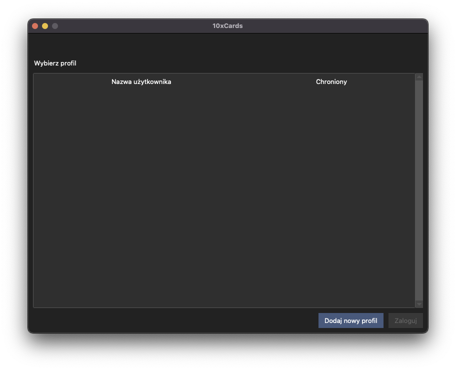
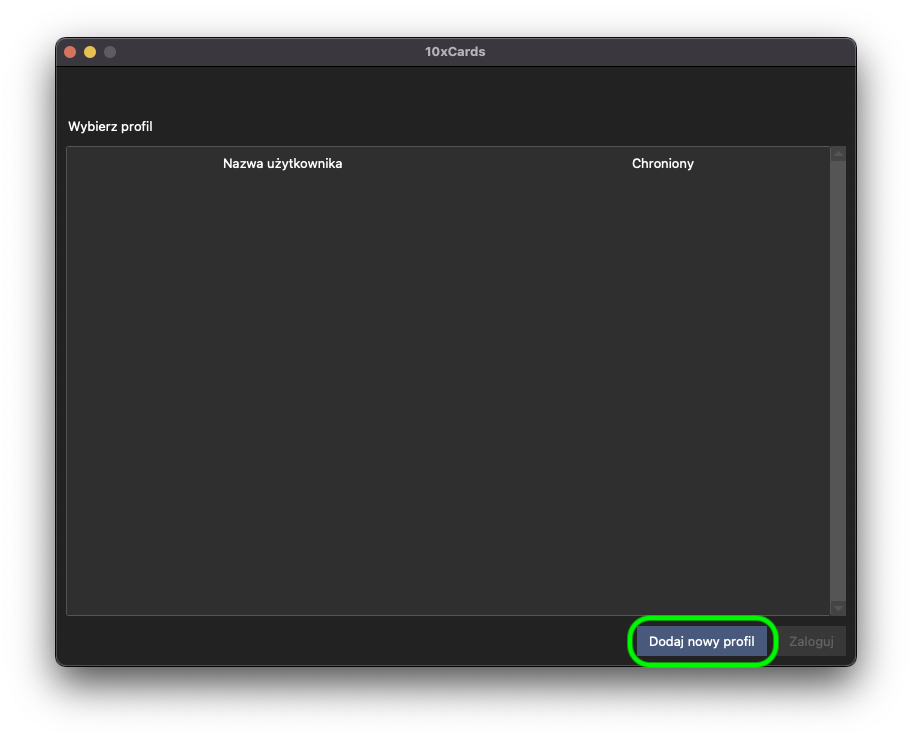
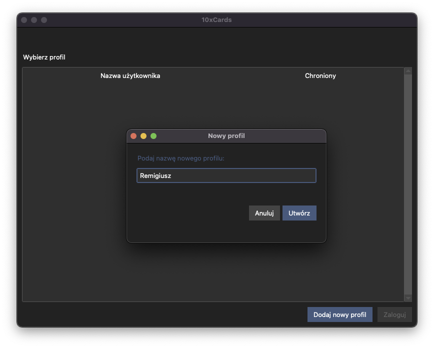
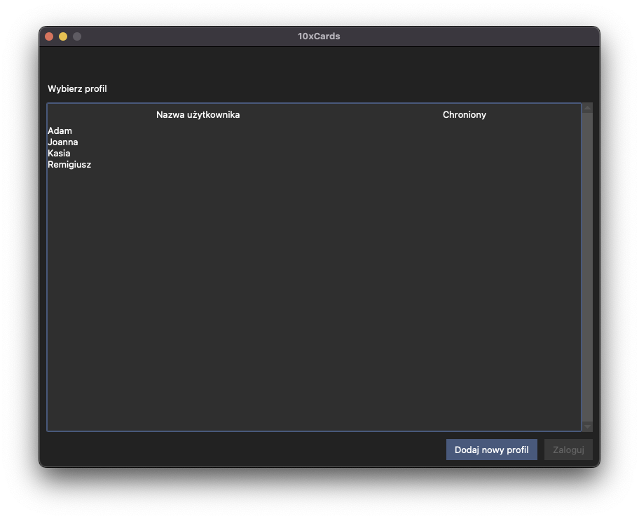
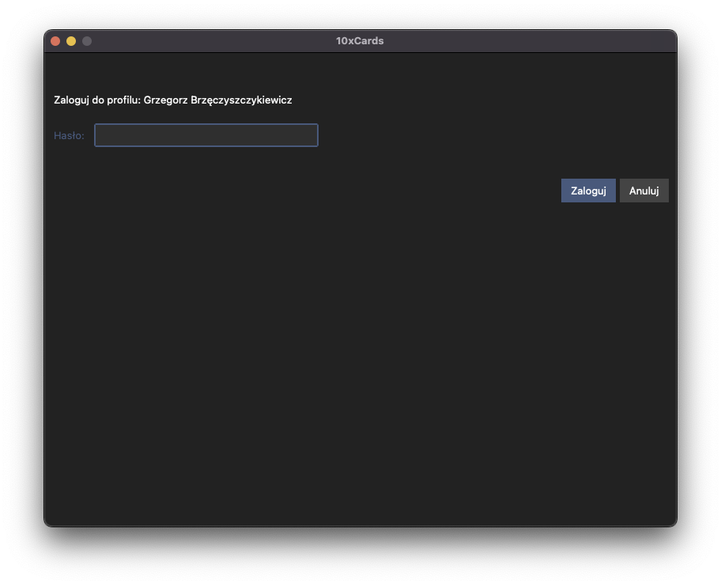

# Pierwsze Kroki 🚀

Ta sekcja przeprowadzi Cię przez pierwsze uruchomienie aplikacji, tworzenie nowego profilu użytkownika oraz logowanie do już istniejącego profilu.

## Uruchamianie aplikacji

Po pobraniu i zainstalowaniu aplikacji 10xCards, uruchom ją zgodnie z instrukcją z README.md (TODO: jak każdą inną aplikację na swoim komputerze macOS). Przy pierwszym uruchomieniu (lub jeśli nie ma jeszcze żadnych profili), zobaczysz ekran powitalny z opcją utworzenia nowego profilu. 

## Tworzenie nowego profilu użytkownika

Aby rozpocząć korzystanie z 10xCards, musisz stworzyć swój profil użytkownika. Profil przechowuje wszystkie Twoje talie fiszek, postępy w nauce i indywidualne ustawienia.

1.  Na ekranie startowym aplikacji kliknij przycisk "Dodaj nowy profil".
    
2.  Pojawi się okno, w którym zostaniesz poproszony o podanie nazwy dla swojego profilu. Pamiętaj, że nazwa profilu:
    *   może mieć maksymalnie 30 znaków,
    *   nie może być pusta,
    *   musi być unikalna – nie możesz utworzyć profilu o nazwie, która już istnieje.
    
3.  Wpisz wybraną nazwę i zatwierdź. Twój nowy profil zostanie utworzony i zapisany.
4.  Nowo utworzony profil pojawi się na liście dostępnych profili na ekranie startowym.

### Opcjonalne hasło do profilu

Początkowo profil tworzony jest bez hasła. Możliwość ustawienia, zmiany lub usunięcia hasła dla swojego profilu znajdziesz w Panelu Ustawień Użytkownika, po zalogowaniu (więcej informacji w sekcji "Panel Ustawień Użytkownika").

## Logowanie do istniejącego profilu

Jeśli masz już utworzony profil (lub kilka profili), przy każdym uruchomieniu aplikacji zobaczysz listę dostępnych profili.

1.  Wybierz swój profil z listy, klikając na jego nazwę.
    
2.  **Jeśli profil nie jest chroniony hasłem:** Po kliknięciu zostaniesz od razu zalogowany i przejdziesz do głównego widoku aplikacji, czyli listy Twoich talii fiszek.
3.  **Jeśli profil jest chroniony hasłem:**
    *   Po kliknięciu na nazwę profilu pojawi się monit z prośbą o podanie hasła.
        
    *   Wprowadź swoje hasło i zatwierdź.
    *   Jeśli hasło jest poprawne, zostaniesz zalogowany i przejdziesz do listy talii.
    *   Jeśli hasło jest niepoprawne, zobaczysz komunikat o błędzie i pozostaniesz na ekranie logowania/wyboru profilu. Możesz spróbować ponownie.

Pamiętaj, że hasła są przechowywane w bezpieczny sposób (zaszyfrowane za pomocą bcrypt), a dane każdego użytkownika są odizolowane od innych profili.

---
⬅️ [Poprzedni rozdział: Wprowadzenie](00_wstep.md)
➡️ [Następny rozdział: Zarządzanie Taliami](02_zarzadzanie_taliami.md)

↩️ [Powrót do Spisu Treści](index.md)
