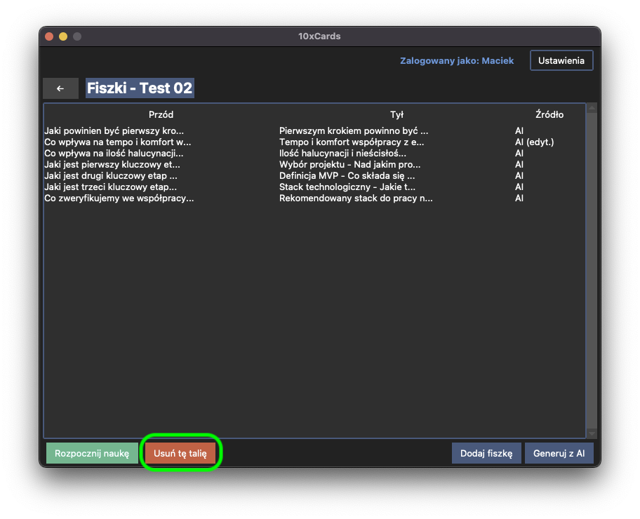

# Zarządzanie Taliami (Decks) 덱

Talie fiszek to podstawowy sposób organizacji Twoich materiałów do nauki w 10xCards. W tej sekcji dowiesz się, jak tworzyć nowe talie, przeglądać istniejące, usuwać je oraz otwierać, aby zobaczyć zawarte w nich fiszki.

Po zalogowaniu się do swojego profilu, głównym ekranem, który zobaczysz, będzie lista Twoich talii. 

## Tworzenie nowej talii

Chcesz zacząć naukę nowego tematu? Utwórz dla niego dedykowaną talię!

1.  W widoku listy talii znajdź i kliknij przycisk "Utwórz nową talię".
    
2.  Pojawi się okno dialogowe, w którym zostaniesz poproszony o podanie nazwy dla nowej talii.
    
    Pamiętaj, że nazwa talii:
    *   musi być unikalna w obrębie Twojego profilu (nie możesz mieć dwóch talii o tej samej nazwie),
    *   nie może być pusta,
    *   może mieć maksymalnie 50 znaków.
3.  Wpisz nazwę, zatwierdź, a nowa, pusta talia zostanie utworzona i powiązana z Twoim profilem użytkownika.
4.  Nowa talia od razu pojawi się na Twojej liście talii.

## Przeglądanie swoich talii

Jak już wspomniano, po zalogowaniu widzisz listę wszystkich talii przypisanych do Twojego profilu. Dla każdej talii na liście widoczna jest jej nazwa. Jeśli lista jest długa, będziesz mógł ją przewijać.

## Otwieranie talii (przeglądanie fiszek w talii)

Aby zobaczyć fiszki znajdujące się w konkretnej talii, po prostu kliknij na jej nazwę na liście talii. Zostaniesz przeniesiony do widoku listy fiszek dla wybranej talii. Więcej na ten temat znajdziesz w sekcji "Zarządzanie Fiszkami".

## Usuwanie talii

Jeśli jakaś talia nie jest Ci już potrzebna, możesz ją usunąć wraz ze wszystkimi fiszkami, które zawiera.

1.  W widoku listy talii, znajdź talię, którą chcesz usunąć. Zainicjuj proces usuwania talii poprzez klinkięcie w przycisk "Usuń tę talię" znajdujący się na dole okna po lewej.
    
2.  Ze względów bezpieczeństwa, przed ostatecznym usunięciem talii aplikacja wyświetli monit z prośbą o potwierdzenie. Zostaniesz poinformowany, że operacja ta usunie również wszystkie fiszki znajdujące się w tej talii oraz ich postępy w nauce (stan FSRS).
    
3.  Jeśli jesteś pewien, potwierdź usunięcie.
4.  Talia wraz ze wszystkimi powiązanymi z nią fiszkami i ich stanami FSRS zostanie trwale usunięta z bazy danych.
5.  Usunięta talia zniknie z Twojej listy talii.

---
⬅️ [Poprzedni rozdział: Pierwsze Kroki](01_pierwsze_kroki.md)
➡️ [Następny rozdział: Zarządzanie Fiszkami](03_zarzadzanie_fiszkami.md)

↩️ [Powrót do Spisu Treści](index.md)
