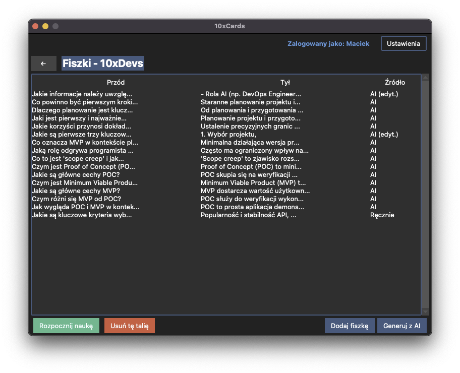
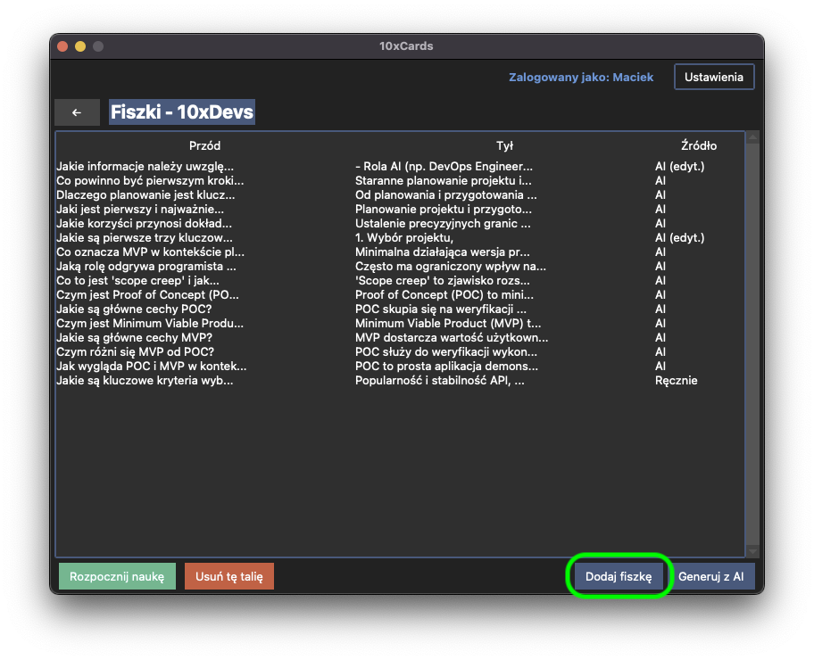
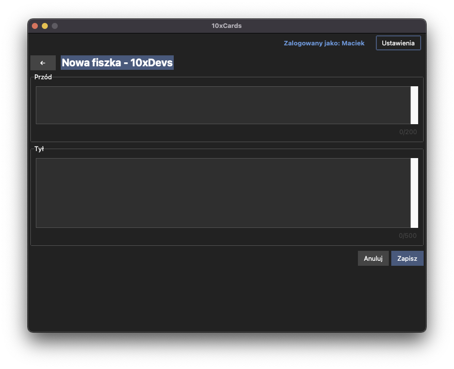
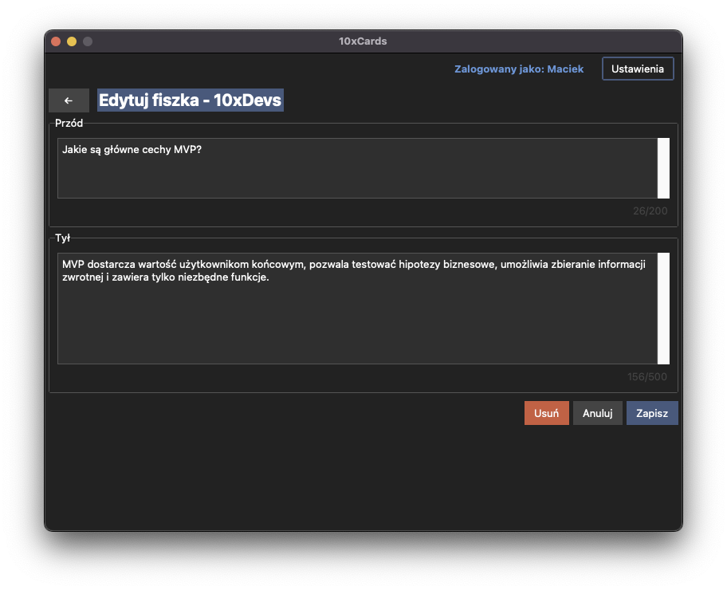
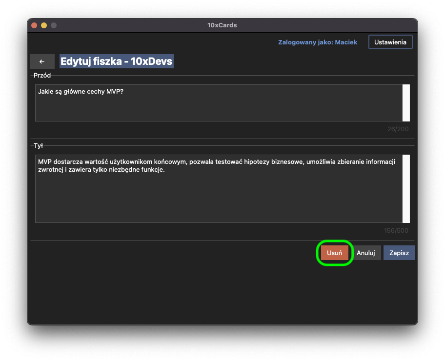
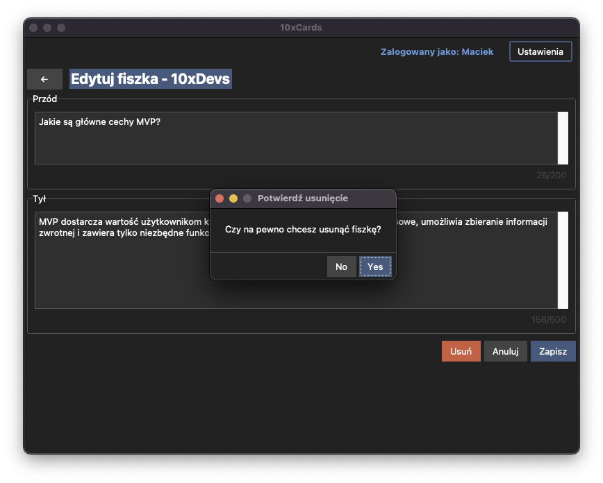

# Zarządzanie Fiszkami (Cards) 🃏

Fiszki to serce aplikacji 10xCards! W tej sekcji dowiesz się wszystkiego o tworzeniu fiszek – zarówno z pomocą sztucznej inteligencji, jak i manualnie – oraz o zarządzaniu nimi: przeglądaniu, edycji i usuwaniu.

Po otwarciu wybranej talii (jak opisano w sekcji "Zarządzanie Taliami"), zobaczysz widok listy fiszek należących do tej talii. 

## Generowanie fiszek z pomocą AI

Jedną z najpotężniejszych funkcji 10xCards jest możliwość automatycznego generowania fiszek z dostarczonego tekstu dzięki integracji z modelami LLM.

### Jak rozpocząć generowanie fiszek AI?

1.  Upewnij się, że jesteś w widoku konkretnej talii, do której chcesz dodać fiszki.
2.  Kliknij w przycisk "Generuj z AI" znajdujący się na dole okna po prawej.
    

### Wklejanie tekstu i inicjowanie procesu

1.  Po wybraniu opcji generowania fiszek AI, pojawi się interfejs z dedykowanym polem tekstowym.
    
2.  Wklej w to pole tekst, z którego chcesz wygenerować fiszki. Pamiętaj o kilku zasadach:
    *   tekst powinien mieć **minimum 1000 znaków**,
    *   tekst nie powinien przekraczać **maksimum 10000 znaków**,
    *   aplikacja powinna poinformować Cię, jeśli tekst nie spełnia tych kryteriów.
3.  Po wklejeniu tekstu i upewnieniu się, że jest poprawny, kliknij przycisk "Generuj fiszki".
4.  Aplikacja wyśle Twój tekst (wraz ze specjalnie przygotowanym promptem) do API usługi OpenRouter.
5.  Podczas gdy AI pracuje nad Twoimi fiszkami, na ekranie powinien być widoczny wskaźnik postępu oraz informacja typu "Trwa generowanie fiszek...".
    

### Przeglądanie, akceptowanie, edytowanie i odrzucanie fiszek od AI

Po chwili (czas generowania może zależeć od długości tekstu i obciążenia API), aplikacja otrzyma odpowiedź od AI i wyświetli Ci po kolei każdą z wygenerowanych fiszek (widok jednej fiszki na raz).

Zazwyczaj AI wygeneruje od 3 do 15 fiszek, każda składająca się z:
*   **przodu (pytanie):** Maksymalnie 200 znaków,
*   **tyłu (odpowiedź):** Maksymalnie 500 znaków.

Dla każdej zaproponowanej fiszki będziesz miał dostępne następujące opcje:

*   **Zapisz i kontynuuj:** Kliknięcie tego przycisku spowoduje zapisanie fiszki w aktualnie wybranej talii. Fiszka zostanie oznaczona jako "ai-generated". Po zaakceptowaniu, przejdziesz do widoku następnej fiszki.
    
*   **Możliwość edycji:** Jeśli chcesz coś zmienić w zaproponowanej fiszce przed jej zapisaniem, możesz swobodnie edytować pola "Przód" i "Tył", które są wypełnione treścią od AI. Po dokonaniu zmian i zapisaniu (przycisk "Zapisz i kontynuuj"), edytowana fiszka trafi do Twojej talii (oznaczona jako "ai-edited") i przejdziesz do widoku następnej fiszki.
    
*   **Odrzuć:** Jeśli uznasz, że dana propozycja jest nieprzydatna, kliknij "Odrzuć". Fiszka nie zostanie zapisana i przejdziesz do widoku następnej fiszki.
    

Możesz przejrzeć wszystkie propozycje i podjąć decyzję dla każdej z nich. Po przetworzeniu wszystkich fiszek lub gdy zdecydujesz się zakończyć przegląd (np. poprzez kliknięcie przycisku wstecz (<-)), wrócisz do widoku listy fiszek w talii.

### Co robić w przypadku błędów generowania AI?

Czasami proces generowania fiszek przez AI może napotkać problemy. Aplikacja poinformuje Cię o tym:

*   **Błędy komunikacji z API AI:** Jeśli wystąpi problem z połączeniem internetowym, nieprawidłowy klucz API (więcej o tym w sekcji "Panel Ustawień") lub inny błąd po stronie serwera AI, zobaczysz odpowiedni komunikat. Np. "Nie udało się połączyć z serwerem AI. Sprawdź połączenie internetowe i konfigurację klucza API."
*   **Problemy z odpowiedzią AI:** Może się zdarzyć, że AI nie zwróci poprawnie sformatowanych fiszek lub odpowiedź będzie pusta. W takim przypadku również otrzymasz stosowną informację. Np. "AI nie wygenerowało poprawnych fiszek dla podanego tekstu. Spróbuj zmodyfikować tekst lub użyć innego fragmentu."

W obu przypadkach zazwyczaj najlepszym rozwiązaniem jest sprawdzenie konfiguracji, połączenia internetowego lub próba z innym fragmentem tekstu.

## Manualne tworzenie i zarządzanie fiszkami

Oprócz generowania fiszek z pomocą AI, zawsze masz możliwość pełnej manualnej kontroli nad swoimi materiałami.

### Tworzenie nowej fiszki ręcznie

Chcesz dodać własną, precyzyjnie sformułowaną fiszkę? Nic prostszego!

1.  W widoku listy fiszek dla wybranej talii, znajdź i kliknij przycisk "Dodaj fiszkę".
    
2.  Pojawi się formularz z dwoma polami tekstowymi:
    *   **Przód:** Tutaj wpisz pytanie, termin lub część informacji, którą chcesz zapamiętać. Limit znaków: 200,
    *   **Tył:** Tutaj wpisz odpowiedź, definicję lub drugą część informacji. Limit znaków: 500.
    
    Aplikacja powinna informować Cię o zbliżaniu się do limitu znaków lub jego przekroczeniu.
3.  Po wypełnieniu obu pól, kliknij przycisk "Zapisz".
4.  Nowa fiszka zostanie utworzona, zapisana w bazie danych, powiązana z bieżącą talią i Twoim profilem (oznaczona jako "manual"). Dla nowej fiszki zostanie również zainicjalizowany stan w systemie powtórek FSRS.
5.  Nowo utworzona fiszka od razu pojawi się na liście fiszek w talii.
6.  Pamiętaj, że zarówno pole "Przód", jak i "Tył" muszą być wypełnione. Próba zapisania fiszki z pustym którymkolwiek z tych pól powinna skutkować komunikatem o błędzie.

### Przeglądanie fiszek w talii

Po otwarciu talii zobaczysz listę wszystkich fiszek, które się w niej znajdują. Dla każdej fiszki na liście powinien być widoczny fragment tekstu przedniej strony oraz fragment tekstu tylnej strony. 

Jeśli lista fiszek jest długa i nie mieści się w całości na ekranie, powinna być możliwość jej przewijania.

### Edycja istniejącej fiszki

Znalazłeś błąd w fiszce lub chcesz ją zaktualizować? Możesz to zrobić w każdej chwili.

1.  Na liście fiszek w talii, znajdź fiszkę, którą chcesz zmodyfikować. Kliknij dwukrotnie w wybraną fiszkę.
2.  Otworzy się formularz identyczny jak przy tworzeniu nowej fiszki, ale pola "Przód" i "Tył" będą już wypełnione aktualną treścią wybranej fiszki.
    
3.  Możesz dowolnie modyfikować tekst w obu polach, pamiętając o limitach znaków (200 dla przodu, 500 dla tyłu).
4.  Po dokonaniu zmian, kliknij przycisk "Zapisz". Zmiany zostaną zapisane w bazie danych dla tej fiszki.
5.  Zaktualizowana treść fiszki będzie od razu widoczna na liście fiszek.
6.  **Ważne:** Edycja fiszki resetuje jej stan w systemie powtórek FSRS. Oznacza to, że system potraktuje ją jak nową fiszkę przy planowaniu kolejnych powtórek.

### Usuwanie fiszki

Jeśli dana fiszka nie jest Ci już potrzebna, możesz ją usunąć z talii.

1.  Na liście fiszek w talii, znajdź fiszkę, którą chcesz usunąć. Kliknij dwukrotnie w wybraną fiszkę.
2.  Otworzy się formularz podglądu i edycji wybranej fiszki.
3.  Kliknij przycisk "Usuń" aby rozpocząć proces usuwania fiszki.
    
4.  Ze względów bezpieczeństwa, przed ostatecznym usunięciem fiszki aplikacja wyświetli monit z prośbą o potwierdzenie.
    
5.  Jeśli jesteś pewien, potwierdź usunięcie.
6.  Fiszka oraz jej stan w systemie FSRS zostaną trwale usunięte z bazy danych.
7.  Usunięta fiszka zniknie z listy fiszek w talii.
