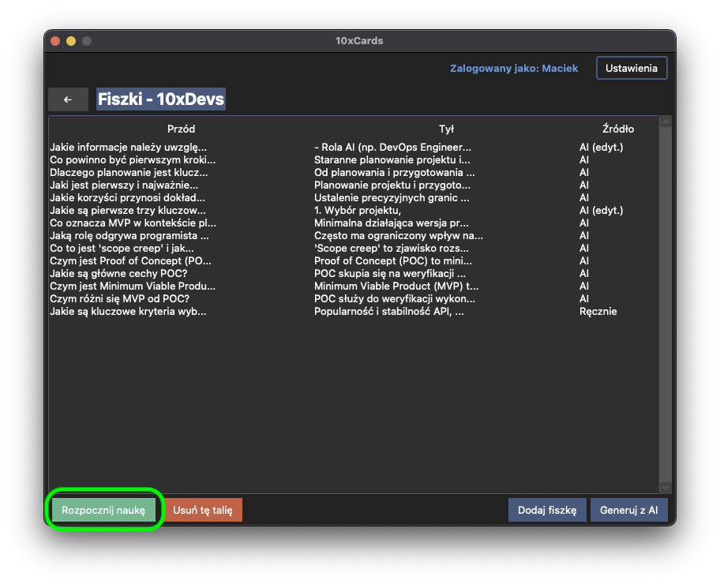
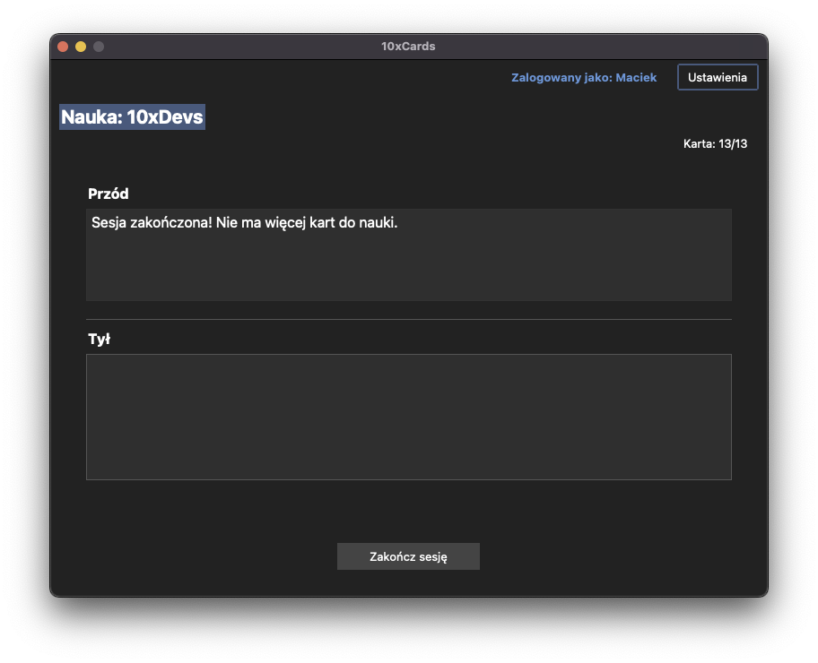
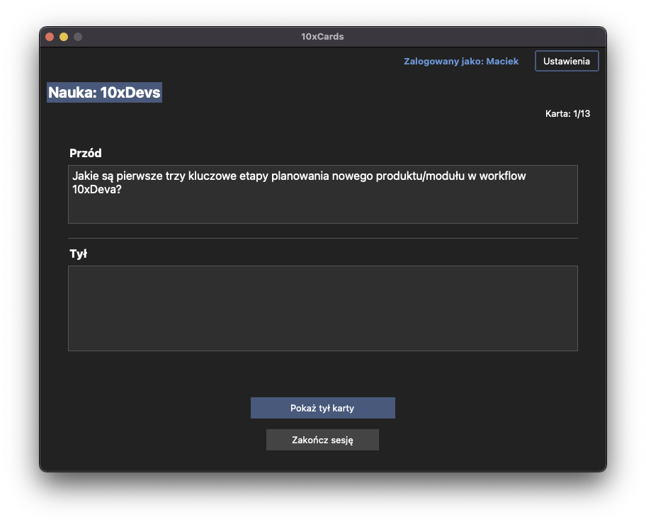
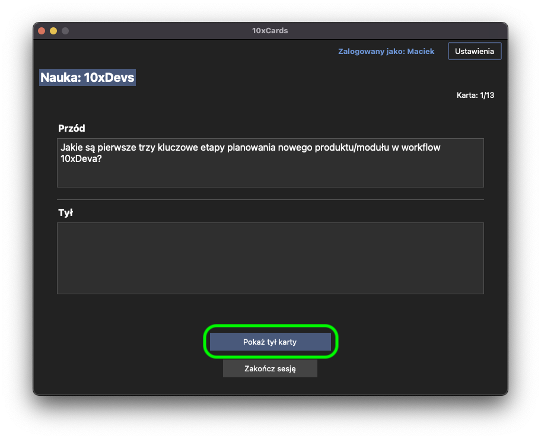
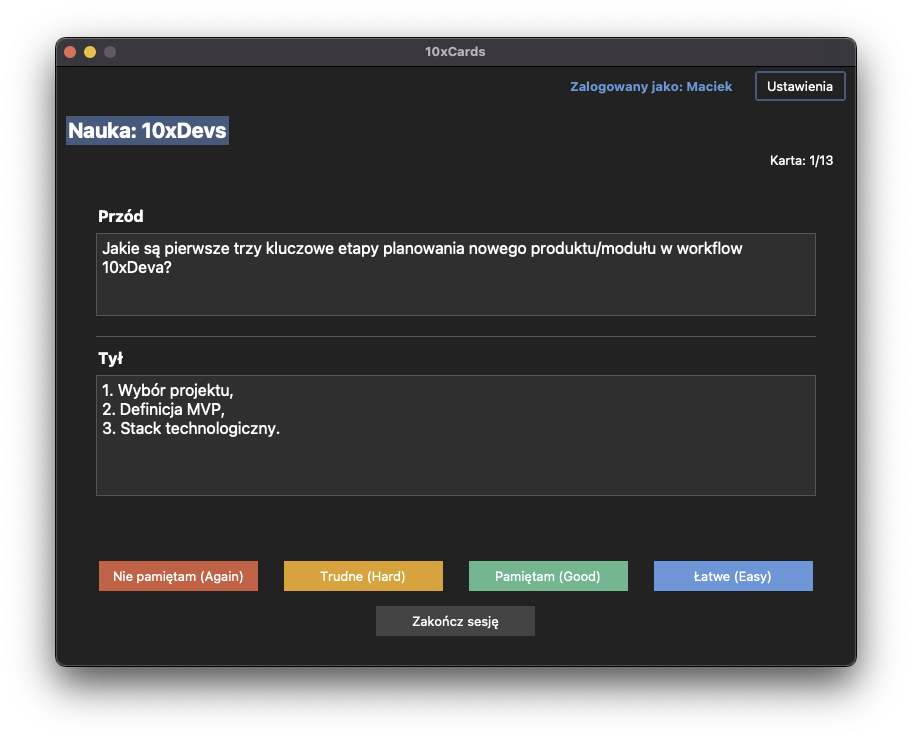
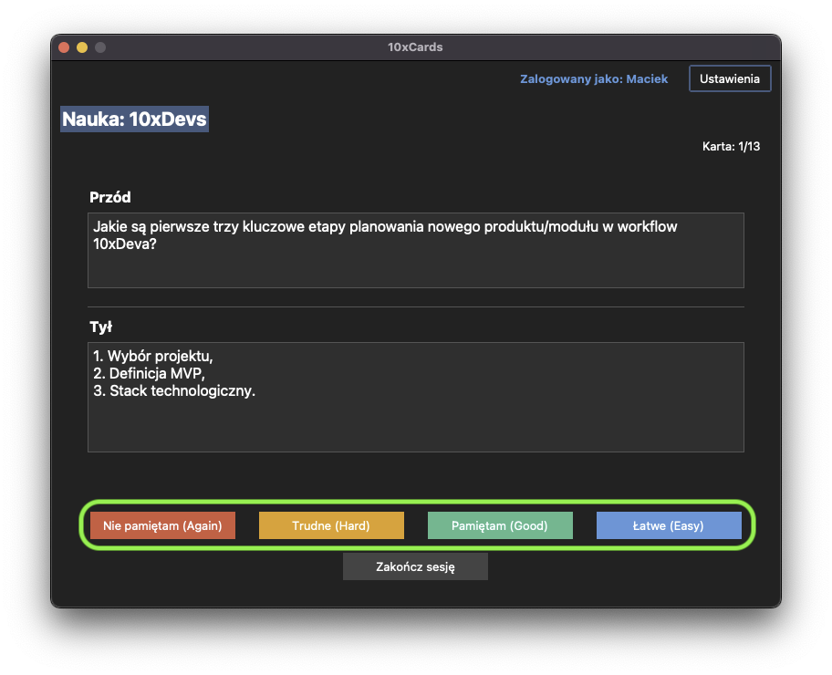

# Sesja Nauki (Study Session) 🧠

Celem 10xCards jest nie tylko tworzenie fiszek, ale przede wszystkim efektywna nauka. Służy do tego dedykowana Sesja Nauki, która wykorzystuje algorytm powtórek rozłożonych w czasie FSRS (Free Spaced Repetition Scheduler), aby optymalnie zarządzać Twoimi powtórkami.

## Rozpoczynanie sesji nauki

Aby rozpocząć naukę z wybranej talii:

1.  Upewnij się, że masz wybraną talię, z której chcesz się uczyć. Sesję nauki możesz rozpocząć z poziomu widoku listy fiszek w danej talii.
2.  Poszukaj przycisku "Rozpocznij naukę" i kliknij go.
    
3.  Aplikacja skomunikuje się z biblioteką `Py-FSRS`, aby określić, które fiszki z tej talii są gotowe do powtórki i w jakiej kolejności powinny zostać wyświetlone.
4.  Jeśli algorytm FSRS wskaże, że w danym momencie nie ma żadnych fiszek wymagających powtórki w tej talii, otrzymasz stosowny komunikat ("Sesja zakończona! Nie ma więcej kart do nauki.").
    
5.  Jeśli są fiszki do nauki, zostaniesz przeniesiony do interfejsu Sesji Nauki, gdzie wyświetlona zostanie strona przednia pierwszej fiszki.

## Interfejs nauki (z FSRS)

Interfejs Sesji Nauki jest zaprojektowany tak, aby skupić Twoją uwagę na procesie uczenia się.

1.  **Wyświetlanie przodu fiszki:** Na ekranie zobaczysz stronę przednią (pytanie, termin) aktualnie powtarzanej fiszki.
2.  **Odsłanianie tyłu fiszki:** Zastanów się nad odpowiedzią. Gdy będziesz gotowy, kliknij przycisk "Pokaż tył karty", aby odsłonić stronę tylną fiszki.
    
3.  Po odsłonięciu, na ekranie pojawi się również strona tylna (odpowiedź, definicja) fiszki.
    

## Ocenianie odpowiedzi (Again, Hard, Good, Easy)

Teraz kluczowy moment – samoocena. Twoja ocena jest niezbędna, aby algorytm FSRS mógł efektywnie zaplanować kolejną powtórkę tej fiszki.

Po odsłonięciu strony tylnej, pojawią się cztery przyciski oceny:

*   **Again (Nie pamiętam):** Wybierz tę opcję, jeśli nie pamiętałeś odpowiedzi lub odpowiedziałeś zupełnie niepoprawnie. Fiszka pojawi się ponownie wkrótce, prawdopodobnie jeszcze w tej samej sesji nauki.
*   **Hard (Trudne):** Wybierz, jeśli odpowiedź sprawiła Ci dużą trudność, przypomniałeś ją sobie z trudem lub była częściowo niepoprawna. Fiszka wróci do powtórki wcześniej niż w przypadku oceny "Good".
*   **Good (Pamiętam):** Wybierz, jeśli odpowiedziałeś poprawnie, ale wymagało to pewnego wysiłku. Jest to standardowa, "dobra" odpowiedź.
*   **Easy (Łatwe):** Wybierz, jeśli odpowiedź była dla Ciebie bardzo łatwa i nie sprawiła żadnego problemu. Fiszka wróci do powtórki znacznie później.

Po kliknięciu jednego z przycisków oceny:

1.  Twoja ocena zostanie przekazana do biblioteki `Py-FSRS`.
2.  Algorytm FSRS zaktualizuje stan powtórki dla tej fiszki, planując jej następne pojawienie się.
3.  Aplikacja automatycznie pobierze kolejną fiszkę do powtórki z FSRS i wyświetli jej stronę przednią, kontynuując cykl.

## Zakończenie sesji

Sesja nauki trwa tak długo, jak długo algorytm FSRS dostarcza kolejne fiszki do powtórki.

*   Gdy algorytm FSRS uzna, że nie ma więcej fiszek do pokazania w danym momencie dla tej talii, sesja nauki zakończy się automatycznie.
*   Zostaniesz o tym poinformowany (komunikatem "Sesja zakończona! Nie ma więcej kart do nauki.").
    
*   Kliknij przycisk "Zakończ sesję" aby wrócić do listy wszystkich fiszek w bieżącej talii.

Możesz również przerwać sesję nauki w dowolnym momencie, poprzez przycisk "Zakończ sesję". Pamiętaj jednak, że regularne kończenie pełnych sesji jest kluczowe dla efektywności metody spaced repetition.
