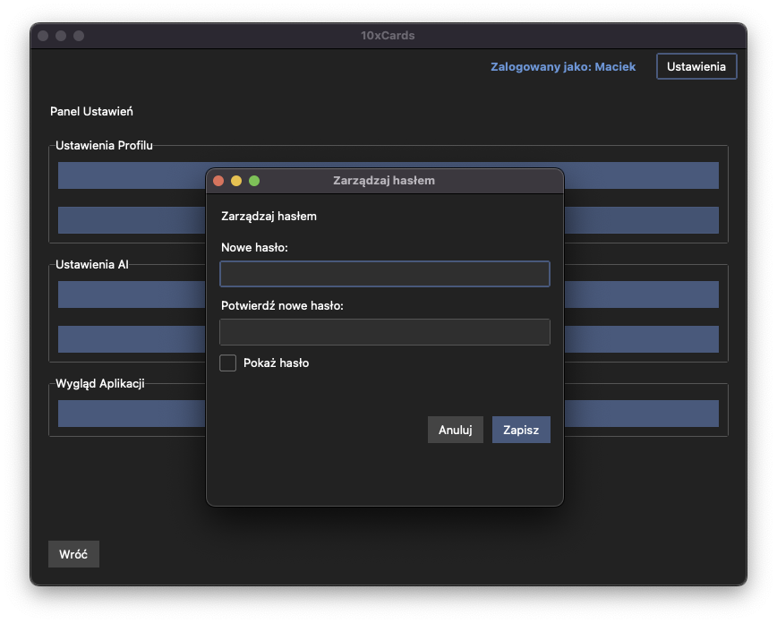
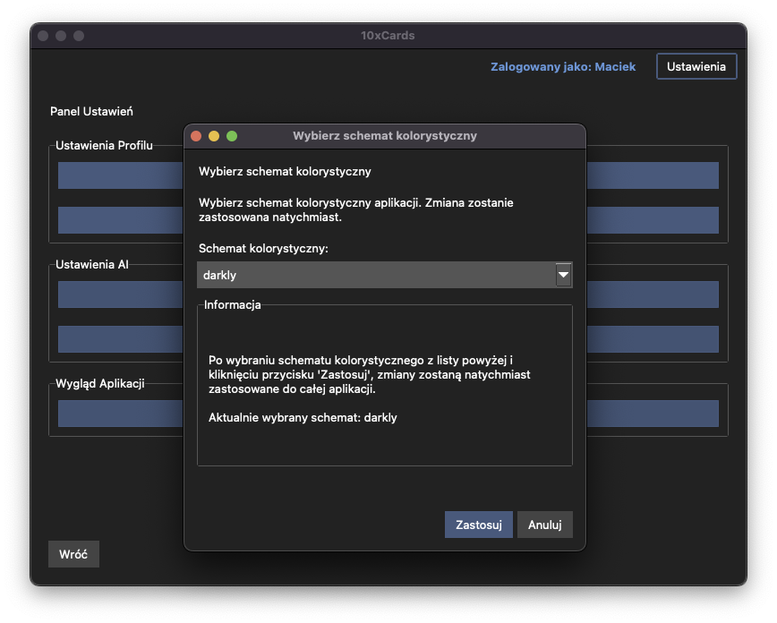

# Panel Ustawień Użytkownika ⚙️

Panel Ustawień Użytkownika to centralne miejsce, w którym możesz zarządzać konfiguracją swojego profilu oraz dostosowywać niektóre aspekty działania aplikacji 10xCards do własnych preferencji. W tej sekcji omówimy, jak uzyskać dostęp do panelu oraz jakie opcje oferuje.

## Dostęp do Panelu Ustawień

1.  Aby przejść do Panelu Ustawień, musisz być zalogowany na swój profil użytkownika.
2.  Po zalogowaniu, poszukaj przycisku "Ustawienia" Znajduje się on na górnym pasku aplikacji, widocznym np. na ekranie listy talii.
    
3.  Kliknięcie tego przycisku przeniesie Cię do głównego ekranu Panelu Ustawień Użytkownika.
    

Panel Ustawień prezentuje listę dostępnych opcji konfiguracyjnych. Każda z tych opcji otwiera dedykowane okno dialogowe lub sekcję, pozwalającą na dokonanie konkretnych zmian. Z Panelu Ustawień masz również możliwość łatwego powrotu do poprzedniego widoku (np. listy talii) za pomocą przycisku "Wróć".

## Opcje dostępne w Panelu Ustawień

Poniżej opisano kluczowe funkcje, które znajdziesz w Panelu Ustawień:

### Zmiana nazwy profilu

Jeśli chcesz zmienić nazwę swojego profilu użytkownika:

1.  W Panelu Ustawień wybierz opcję "Zmień nazwę profilu".
2.  Otworzy się okno dialogowe, w którym zobaczysz pole tekstowe, wypełnione Twoją aktualną nazwą profilu.
    
3.  Wprowadź nową nazwę. Pamiętaj o zasadach:
    *   nowa nazwa musi być unikalna wśród wszystkich istniejących profili,
    *   nazwa nie może być pusta,
    *   maksymalna długość nazwy to 30 znaków.
4.  Jeśli spróbujesz zapisać niepoprawną nazwę (np. już istniejącą, pustą, zbyt długą), aplikacja powinna wyświetlić komunikat o błędzie, a zmiana nie zostanie zapisana.
5.  Po wprowadzeniu poprawnej nowej nazwy i kliknięciu przycisku "Zapisz", nazwa Twojego profilu zostanie zaktualizowana w bazie danych.
6.  Otrzymasz potwierdzenie dokonania zmiany (stosowny komunikat), a okno dialogowe zamknie się, wracając do głównego widoku Panelu Ustawień.

### Zarządzanie hasłem profilu

Ta opcja pozwala Ci ustawić, zmienić lub całkowicie usunąć hasło chroniące Twój profil.

1.  W Panelu Ustawień wybierz opcję "Zarządzaj hasłem" (lub podobną).
2.  Otworzy się dedykowane okno dialogowe.
    

    **Jeśli hasło nie jest jeszcze ustawione:**
    *   Zostaniesz poproszony o wprowadzenie nowego hasła oraz jego potwierdzenie (wpisanie drugi raz w celu uniknięcia pomyłek).
        
    *   Po zatwierdzeniu, nowe hasło zostanie zaszyfrowane (przy użyciu bcrypt) i zapisane w bazie danych dla Twojego profilu.
    *   Otrzymasz potwierdzenie, że hasło zostało pomyślnie ustawione.

    **Jeśli hasło jest już ustawione:**
    *   Najpierw zostaniesz poproszony o podanie swojego **aktualnego hasła** – jest to zabezpieczenie potwierdzające, że to Ty dokonujesz zmiany.
        
    *   Następnie będziesz mógł wprowadzić **nowe hasło** i jego potwierdzenie. Jeśli chcesz **usunąć hasło**, po prostu pozostaw pola nowego hasła puste.
        
    *   Po wprowadzeniu poprawnego aktualnego hasła i zatwierdzeniu:
        *   Jeśli podałeś nowe hasło, zostanie ono zaszyfrowane (bcrypt) i zaktualizuje istniejące w bazie. Otrzymasz potwierdzenie.
        *   Jeśli pola nowego hasła pozostały puste (w celu usunięcia hasła), dotychczasowe hasło zostanie usunięte z bazy danych. Otrzymasz potwierdzenie.
    *   Jeśli wprowadzisz niepoprawne aktualne hasło, zobaczysz komunikat o błędzie, a zmiany nie zostaną wprowadzone.

3.  Okno dialogowe zarządzania hasłem zawiera przyciski typu "Zapisz" oraz "Anuluj".
4.  Po pomyślnie zakończonej operacji (ustawienie/zmiana/usunięcie hasła), wrócisz do głównego widoku Panelu Ustawień.

### Zarządzanie kluczem API OpenRouter

Jeśli chcesz korzystać z funkcji generowania fiszek przez AI, musisz podać swój klucz API dla usługi OpenRouter.ai. Ta sekcja pozwala na zarządzanie tym kluczem.

1.  W Panelu Ustawień wybierz opcję "Klucz API OpenRouter".
2.  Otworzy się okno dialogowe.
    
3.  W oknie znajdziesz pole do wprowadzenia lub edycji Twojego klucza API.
    *   Jeśli klucz API jest już zapisany, ze względów bezpieczeństwa nie będzie wyświetlany w pełnej, jawnej formie. Zamiast tego będzie zamaskowany (np. `sk-xxxx...xxxx`).
4.  Możesz:
    *   **wprowadzić nowy klucz:** Jeśli nie masz jeszcze zapisanego klucza,
    *   **zaktualizować istniejący klucz:** Wpisując nowy klucz w miejsce starego (zamaskowanego),
    *   **usunąć klucz:** Poprzez wyczyszczenie pola i zapisanie.
5.  Po kliknięciu przycisku "Zapisz i weryfikuj":
    *   **Walidacja:** Jeśli wprowadziłeś nowy lub zmieniłeś istniejący klucz, aplikacja spróbuje go zwalidować poprzez testowe zapytanie do API OpenRouter. Jest to ważne, aby upewnić się, że klucz jest poprawny, zanim zostanie zapisany.
    *   **Sukces walidacji:** Jeśli walidacja przebiegnie pomyślnie, klucz API zostanie zaszyfrowany i zapisany (lub zaktualizowany) w bazie danych. Otrzymasz komunikat potwierdzający, np. "Klucz API jest poprawny. Zapis klucza zakończył się sukcesem.".
    *   **Nieudana walidacja:** Jeśli klucz okaże się niepoprawny, nie zostanie on zapisany. Otrzymasz komunikat o błędzie, np. "Wprowadzony klucz API jest niepoprawny. Zapis klucza anulowany.".
    *   **Usunięcie klucza:** Jeśli zdecydowałeś się usunąć klucz, zostanie on usunięty z bazy danych, a Ty otrzymasz potwierdzenie.
6.  Okno dialogowe zawiera przyciski "Zapisz i weryfikuj" oraz "Anuluj".
7.  Po pomyślnej operacji (zapisie lub usunięciu klucza) wrócisz do głównego widoku Panelu Ustawień.
8.  **Ważne:** Jeśli klucz API nie jest ustawiony lub został usunięty, przy próbie skorzystania z funkcji generowania fiszek przez AI, aplikacja wyświetli komunikat informujący o braku klucza i konieczności jego skonfigurowania w Panelu Ustawień.

### Wybór domyślnego modelu LLM

10xCards może wspierać różne modele językowe (LLM) do generowania fiszek (za pośrednictwem OpenRouter). Tutaj możesz wybrać, który model ma być używany domyślnie.

1.  W Panelu Ustawień wybierz opcję "Domyślny model LLM".
2.  Otworzy się okno dialogowe z listą rozwijaną, zawierającą dostępne LLM. Lista tych modeli jest predefiniowana i przechowywana w pliku konfiguracyjnym aplikacji.
    
3.  Twój aktualnie wybrany domyślny LLM powinien być zaznaczony na liście.
4.  Wybierz preferowany model z listy i kliknij przycisk "Zapisz".
5.  Wybrany model zostanie zapisany jako domyślny dla Twojego profilu użytkownika w bazie danych. Otrzymasz potwierdzenie zapisu.
6.  Okno dialogowe zamknie się, a Ty wrócisz do Panelu Ustawień.
7.  Wybrany domyślny model LLM (lub jego identyfikator) powinien być widoczny na ekranie generowania fiszek, abyś wiedział, który model zostanie użyty.
    

    **Obsługa niedostępności modelu:**
    Może się zdarzyć, że LLM, który wcześniej ustawiłeś jako domyślny, zostanie usunięty z globalnej listy dostępnych modeli w aplikacji (np. po aktualizacji pliku konfiguracyjnego przez deweloperów). W takiej sytuacji:
    *   Aplikacja użyje pierwszego dostępnego modelu z aktualnej listy jako modelu zastępczego do generowania fiszek.
    *   Przy następnym logowaniu lub przy pierwszej próbie użycia funkcji AI, powinieneś otrzymać jednorazowy komunikat informujący, że Twój poprzedni domyślny model nie jest już dostępny, został ustawiony model zastępczy, oraz sugestię, abyś wybrał nowy domyślny model w Panelu Ustawień.

### Wybór schematu kolorystycznego aplikacji

Aby dostosować wygląd aplikacji do swoich upodobań, możesz wybrać jeden z predefiniowanych schematów kolorystycznych (motywów).

1.  W Panelu Ustawień wybierz opcję "Schemat kolorystyczny".
2.  Otworzy się okno dialogowe z listą rozwijaną dostępnych schematów kolorystycznych. Lista tych schematów jest przechowywana w pliku konfiguracyjnym aplikacji.
    
3.  Aktualnie aktywny schemat kolorystyczny powinien być zaznaczony na liście.
4.  Wybierz preferowany schemat z listy.
5.  Po wybraniu schematu i kliknięciu przycisku "Zastosuj":
    *   Wybrany schemat kolorystyczny powinien być **natychmiast aplikowany** do aktywnego okna aplikacji (czyli Panelu Ustawień). Dzięki temu od razu zobaczysz efekt swojej zmiany.
    *   Wybrany schemat zostanie zapisany jako Twoja preferencja dla Twojego profilu użytkownika w bazie danych.
    *   Otrzymasz potwierdzenie (może być ono czysto wizualne – poprzez zmianę wyglądu aplikacji).
6.  Okno dialogowe zamknie się, a Ty wrócisz do Panelu Ustawień, który również powinien już odzwierciedlać nowo wybrany schemat kolorystyczny.
    
7.  Pozostałe, nieaktywne lub zamknięte wcześniej okna aplikacji zaktualizują swój wygląd po ich ponownym otwarciu.

---
⬅️ [Poprzedni rozdział: Sesja Nauki](04_sesja_nauki.md)

↩️ [Powrót do Spisu Treści](index.md)
